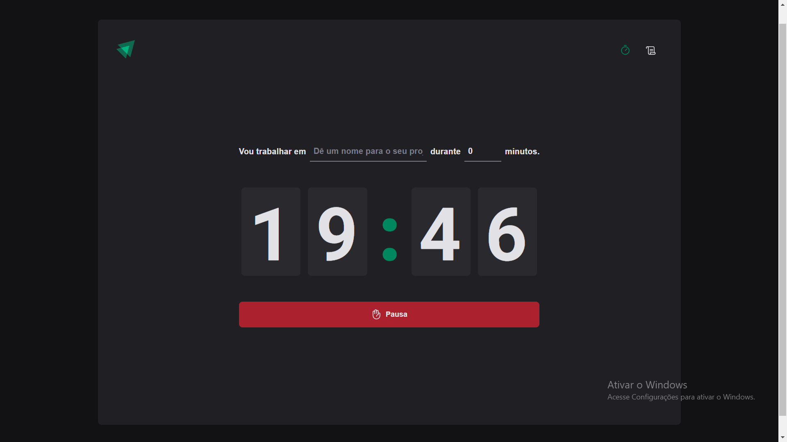
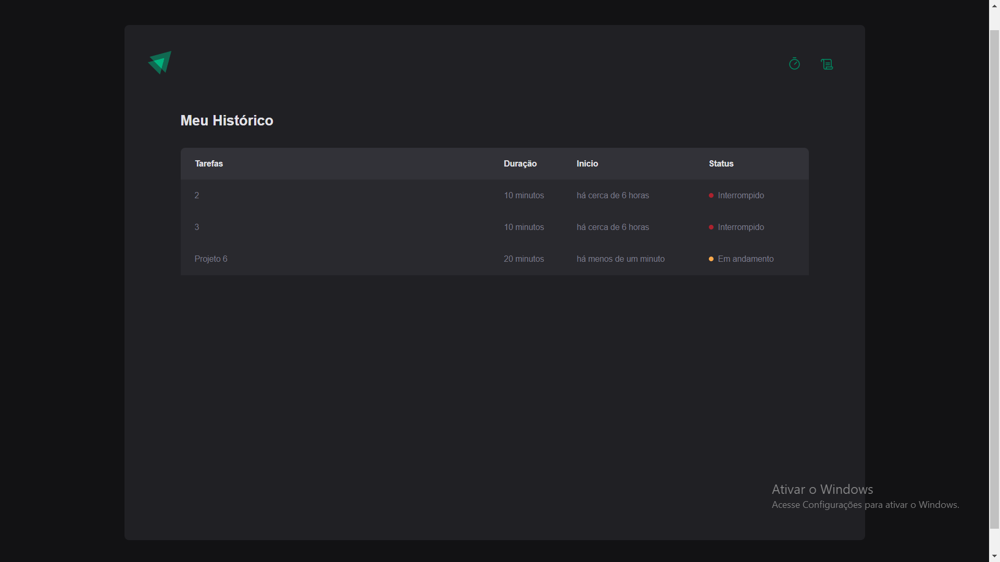

# Ignite-Timer

Aplicativo Pomodoro em React-typescript

É um app que tem como objetivo ajudar as pessoas a gerencia o tempo durantes as suas tarefas.

Na aplicação você defini o nome do projeto e o tempo, também tem acesso ao histórico das gestões que ficam armazenados no localstorage.

----------

### Desnevolvimento do Projeto
<ul>
  <li>Rotas e Navegação com React-Router-Dom</li>
  <li>Context API - para compartilhar dados e informações entre os componentes</li>
  <li>Reducers - alternativa do useState para funções com lógicas mais complexas </li>
  <li>Immer</li>
  <li>LocalStorage</li>
  <li>Styled-components para estilos</li>
</ul>

----------

### Figma

[Design Figma](https://www.figma.com/file/j7UtutsLDZK5Zx7LJ6KgaN/Ignite-Timer-(Community)?node-id=0%3A1)

---------------

### Imagens




------------------

### Immer
A biblioteca Immer ajuda a lidar com os dados da  aplicação sem ter que se preocupar com a imutabilidade do react.

-------------

### Deploy 
Para facilitar a visualização da aplicação, ela já foi colocada no ar com auxílio do [vercel](https://vercel.com/), assim como foi solicitado , e seu deploy pode ser acessado no seguinte link: [ignite-timer](https://ignite-timer-g64a.vercel.app/)

Além disso, pode-se optar ainda por clonar este repositório e utilizar, por exemplo,  lendo as instruções a seguir.

### Executando Localmente
1. Primeiro passo
```
git clone https://github.com/Drlazinho/ignite-timer.git
```
2. Em seguida entre no diretório usando o terminal
```
cd ignite-timer
```
3. Depois de selecionado o diretório digite no terminal.
```
yarn install

or 

npm install
```
4. E por último execute um dos seguintes commandos, que deve ter a mesma primeira palavra chave do comando anterior.
````
yarn dev

or

npm run dev
````

Por fim poderá usar a IDE de sua escolha para testar essa aplicação.